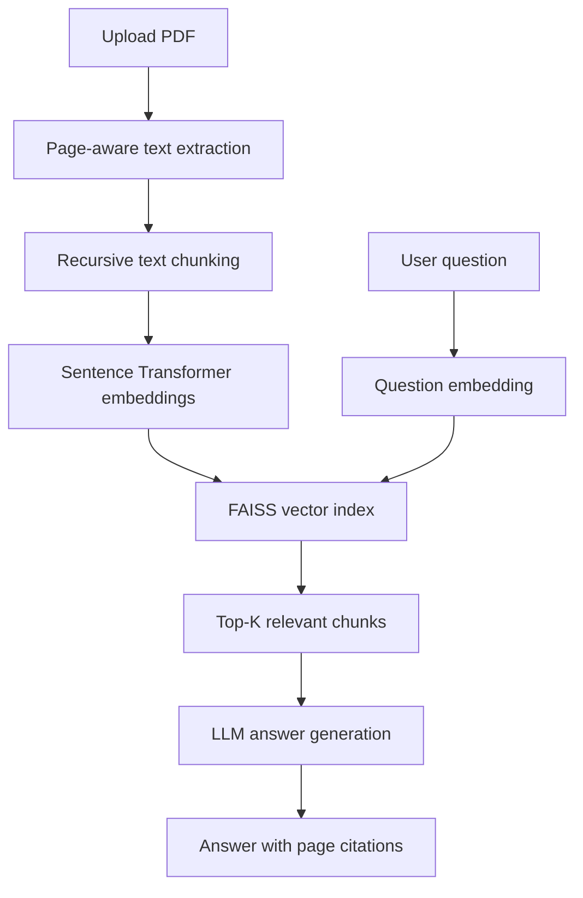

# DocuLens — Document Intelligence and RAG Evaluation System

DocuLens is a full-stack document question-answering system that uses Retrieval-Augmented Generation (RAG) to generate grounded answers from PDF documents. It supports page-level citations, configurable document chunking, semantic retrieval using FAISS, session-based conversation history, and systematic evaluation of retrieval configurations.

## Features

- Upload and process PDF documents
- Page-aware text extraction using PyMuPDF
- Configurable recursive text chunking
- Local semantic embeddings using Sentence Transformers
- Fast vector similarity search with FAISS
- LLM-based grounded answer generation
- Page-level citations for generated answers
- Session-based conversation history
- Temporary document indexes for isolated sessions
- React interface for uploading documents and asking questions
- RAG evaluation using Recall@K and citation accuracy
- Comparison of chunk size, chunk overlap, and retrieval settings

## Tech Stack

### Backend

- Python
- FastAPI
- PyMuPDF
- Sentence Transformers
- FAISS
- LLM API
- Uvicorn

### Frontend

- React
- JavaScript
- CSS
- Fetch API / Axios

## System Architecture



## How It Works

1. The user uploads a PDF document through the React interface.
2. The backend extracts text from each page using PyMuPDF.
3. The extracted text is divided into overlapping chunks while retaining page metadata.
4. Sentence Transformers generate a semantic embedding for every chunk.
5. The embeddings are stored in a temporary FAISS vector index.
6. When the user submits a question, the question is converted into an embedding.
7. FAISS retrieves the most semantically relevant chunks.
8. The retrieved context and conversation history are passed to the LLM.
9. The LLM generates an answer grounded in the retrieved content.
10. The response is returned with citations to the relevant PDF pages.

## Project Structure

```text
DocuLens/
├── backend/
│   ├── app/
│   │   ├── main.py
│   │   ├── api/
│   │   │   ├── upload.py
│   │   │   ├── query.py
│   │   │   └── evaluation.py
│   │   ├── services/
│   │   │   ├── pdf_processor.py
│   │   │   ├── chunker.py
│   │   │   ├── embedding_service.py
│   │   │   ├── vector_store.py
│   │   │   ├── rag_service.py
│   │   │   └── evaluation_service.py
│   │   ├── models/
│   │   │   └── schemas.py
│   │   └── core/
│   │       └── config.py
│   ├── tests/
│   ├── requirements.txt
│   └── .env.example
├── frontend/
│   ├── src/
│   │   ├── components/
│   │   │   ├── DocumentUpload.jsx
│   │   │   ├── ChatWindow.jsx
│   │   │   ├── QueryInput.jsx
│   │   │   └── CitationList.jsx
│   │   ├── services/
│   │   │   └── api.js
│   │   ├── App.jsx
│   │   └── main.jsx
│   ├── package.json
│   └── .env.example
├── evaluation/
│   ├── labelled_questions.json
│   └── results/
├── .gitignore
└── README.md
```

> The exact folder structure may differ depending on the current implementation.

## Getting Started

### Prerequisites

Install the following before running the project:

- Python 3.10 or later
- Node.js 18 or later
- npm
- An API key for the configured LLM provider

## Backend Setup

### 1. Clone the repository

```bash
git clone <your-repository-url>
cd DocuLens
```

### 2. Create a virtual environment

```bash
cd backend
python -m venv venv
```

Activate the environment:

#### macOS/Linux

```bash
source venv/bin/activate
```

#### Windows PowerShell

```powershell
venv\Scripts\Activate.ps1
```

#### Windows Command Prompt

```cmd
venv\Scripts\activate
```

### 3. Install dependencies

```bash
pip install -r requirements.txt
```

### 4. Configure environment variables

Create a `.env` file inside the `backend` directory:

```env
LLM_API_KEY=your_api_key
LLM_MODEL=your_model_name
EMBEDDING_MODEL=sentence-transformers/all-MiniLM-L6-v2

CHUNK_SIZE=800
CHUNK_OVERLAP=150
TOP_K=5

FRONTEND_URL=http://localhost:5173
```

Use the variable name required by your LLM provider if it differs from `LLM_API_KEY`.

### 5. Start the backend

```bash
uvicorn app.main:app --reload
```

The backend will run at:

```text
http://localhost:8000
```

Interactive API documentation is available at:

```text
http://localhost:8000/docs
```

## Frontend Setup

Open another terminal:

```bash
cd frontend
npm install
```

Create a `.env` file inside the `frontend` directory:

```env
VITE_API_BASE_URL=http://localhost:8000
```

Start the React development server:

```bash
npm run dev
```

The frontend will normally be available at:

```text
http://localhost:5173
```

## API Overview

### Upload a document

```http
POST /documents/upload
```

Uploads and indexes a PDF document.

Example response:

```json
{
  "session_id": "68a90695-c590-4f7b-917d-8ad44e22d690",
  "file_name": "document.pdf",
  "page_count": 24,
  "chunk_count": 96,
  "message": "Document indexed successfully"
}
```

### Ask a question

```http
POST /query
```

Example request:

```json
{
  "session_id": "68a90695-c590-4f7b-917d-8ad44e22d690",
  "question": "What are the main conclusions of the document?",
  "top_k": 5
}
```

Example response:

```json
{
  "answer": "The document concludes that...",
  "citations": [
    {
      "page": 8,
      "text": "Relevant passage from the document...",
      "score": 0.86
    }
  ]
}
```

### Run an evaluation

```http
POST /evaluation/run
```

Example request:

```json
{
  "dataset_path": "evaluation/labelled_questions.json",
  "chunk_sizes": [400, 800, 1200],
  "chunk_overlaps": [50, 100, 150],
  "top_k_values": [3, 5, 10]
}
```

The exact endpoint names may be adjusted to match the implemented routes.

## RAG Pipeline

### 1. PDF Extraction

PyMuPDF extracts text page by page. Each extracted block retains its source page number so that citations can be traced back to the original document.

### 2. Recursive Chunking

The extracted text is divided into smaller overlapping chunks. The main configurable parameters are:

- `chunk_size`: maximum size of each chunk
- `chunk_overlap`: repeated context shared by consecutive chunks

Chunk overlap helps preserve information that may otherwise be split across chunk boundaries.

### 3. Embedding Generation

A Sentence Transformer model generates dense vector representations for document chunks and user questions. Embeddings are produced locally, reducing dependency on external embedding APIs.

### 4. Vector Retrieval

Chunk embeddings are stored in a FAISS index. For each question, the system retrieves the top-K chunks with the highest semantic similarity.

### 5. Grounded Generation

The LLM receives:

- The user’s question
- The retrieved document chunks
- Page metadata
- Relevant conversation history

The prompt instructs the model to answer only from the supplied document context and provide page-level citations.

## Evaluation Pipeline

DocuLens includes an evaluation pipeline for comparing different RAG configurations on a labelled question set.

### Example evaluation dataset

```json
[
  {
    "question": "What method was used in the study?",
    "relevant_pages": [4, 5]
  },
  {
    "question": "What limitations were identified?",
    "relevant_pages": [12]
  }
]
```

### Evaluated Parameters

- Chunk size
- Chunk overlap
- Number of retrieved chunks
- Embedding model
- Retrieval configuration

### Recall@K

Recall@K measures whether the expected source page or relevant chunk appears among the top-K retrieved results.

```text
Recall@K =
Questions with relevant evidence in top-K results
-------------------------------------------------
Total number of evaluated questions
```

A higher Recall@K indicates that the retriever is more consistently finding the required evidence.

### Citation Accuracy

Citation accuracy measures whether the pages cited in the generated response match the labelled source pages.

```text
Citation Accuracy =
Correctly cited answers
-----------------------
Total evaluated answers
```

### Example Results

| Chunk Size | Overlap | Top-K | Recall@K | Citation Accuracy |
|-----------:|--------:|------:|---------:|------------------:|
| 400        | 50      | 3     | 0.78     | 0.74              |
| 800        | 150     | 5     | 0.86     | 0.82              |
| 1200       | 200     | 5     | 0.83     | 0.79              |

> Replace these sample values with results produced by your evaluation pipeline.

## Design Decisions

### Local Embeddings

Sentence Transformers generate embeddings locally, reducing API cost and allowing document retrieval to run without sending raw document chunks to an embedding service.

### Temporary Document Indexing

Each uploaded document is indexed temporarily and associated with a session. This isolates user documents and prevents unrelated documents from affecting retrieval.

### Page-Aware Metadata

Every chunk stores its originating page number. This allows the system to return verifiable citations with each generated answer.

### Configurable Retrieval

Chunk size, chunk overlap, and Top-K retrieval can be changed and evaluated rather than being treated as fixed values.

### Session-Based Conversations

Conversation history is maintained per session, enabling follow-up questions while keeping different document sessions isolated.

## Limitations

- Text extraction quality depends on the structure of the uploaded PDF.
- Scanned PDFs require an OCR pipeline before indexing.
- Temporary indexes are removed after the session expires or the server restarts.
- Citation quality depends on both retrieval performance and LLM instruction-following.
- Very large PDFs may require batching or persistent vector storage.
- The system currently focuses on PDF documents.

## Future Improvements

- OCR support for scanned and image-based PDFs
- Persistent document and vector storage
- Hybrid semantic and keyword retrieval
- Cross-encoder reranking
- Multi-document querying
- Streaming LLM responses
- User authentication and saved document collections
- Automated faithfulness and answer-relevance evaluation
- Support for DOCX, TXT, HTML, and other document formats
- Docker-based deployment
- Cloud object storage integration

## Security and Privacy

- API keys must be stored in environment variables.
- `.env` files should never be committed to Git.
- Uploaded documents should be validated by file type and size.
- Temporary files and indexes should be deleted after session expiration.
- Production deployments should include authentication, request limits, and secure file handling.

## License

This project is intended for educational and portfolio purposes. Add an appropriate open-source license before redistributing or accepting external contributions.

## Author

**Pochimireddy Ajith Reddy**

- GitHub: [ajithreddy1234](https://github.com/ajithreddy1234)
